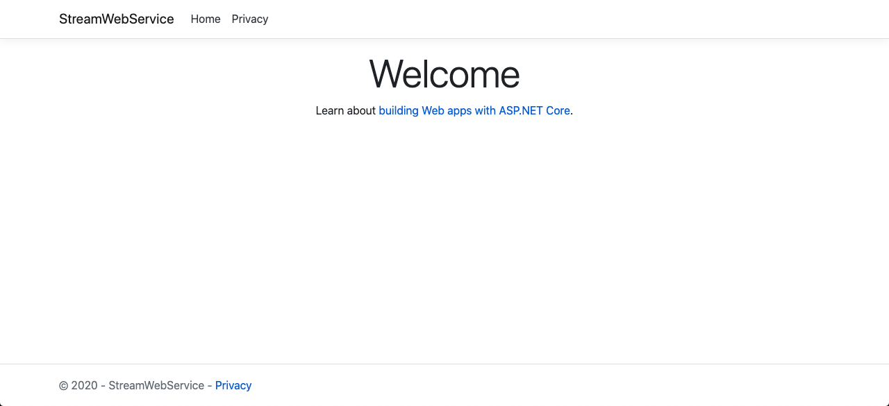
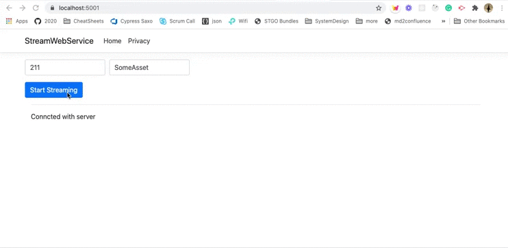

Refer : https://docs.microsoft.com/en-us/aspnet/core/tutorials/signalr?view=aspnetcore-3.1&tabs=visual-studio-code


### Create a webapp 

```
# Creat a webapp for streaming to client
dotnet new webapp -o StreamWebService

cd StreamWebService

# Create dockerignore for the project
dotnet new dockerignore
```


open http://localhost:5000/



```bash
git add --all
git commit -m "Create web app"
```


### Add SignalR to web app

**Add support for SignalR in server app**

In `Startup.cs`, initialize SignalR on server side by adding this to `ConfigureServices`

```diff
	public void ConfigureServices(IServiceCollection services)
	{
		services.AddRazorPages();
+		services.AddSignalR();
	}

```


**Create SignalR Hub**

Create a file `PricingHub.cs`: 

```csharp
using System;
using System.Collections.Generic;
using System.Runtime.CompilerServices;
using System.Threading;
using System.Threading.Tasks;
using Microsoft.AspNetCore.SignalR;

namespace StreamWebService
{
  public class PricingHub : Hub
  {
    
    public async IAsyncEnumerable<string> Subscribe(
            string uic,
            string assetType,
            [EnumeratorCancellation]
            CancellationToken cancellationToken)
    {
      for (var i = 0; i < 10; i++)
      {
        // Check the cancellation token regularly so that the server will stop
        // producing items if the client disconnects.
        cancellationToken.ThrowIfCancellationRequested();

        yield return $"{i} : {uic}-{assetType}";

        // Use the cancellationToken in other APIs that accept cancellation
        // tokens so the cancellation can flow down to them.
        await Task.Delay(TimeSpan.FromSeconds(1), cancellationToken);
      }
    }
  }
}
```

Add the PricingHub to endoints in `Startup.cs`

```diff
  app.UseEndpoints(endpoints =>
  {
  	endpoints.MapRazorPages();
+  	endpoints.MapHub<PricingHub>("/subscribe/infoprice");
  });
```


**Add SignalR client side library with libman**

```bash
# Install libman
dotnet tool install -g Microsoft.Web.LibraryManager.Cli

# Add SignalR client using libman
libman install @microsoft/signalr@latest -p unpkg -d wwwroot/js/signalr --files dist/browser/signalr.js --files dist/browser/signalr.min.js
# wwwroot/js/signalr/dist/browser/signalr.js written to disk
# wwwroot/js/signalr/dist/browser/signalr.min.js written to disk
# Installed library "@microsoft/signalr@latest" to "wwwroot/js/signalr"
```

Check files created by libman : 

```bash
git status
#	new file:   libman.json
#	new file:   wwwroot/js/signalr/dist/browser/signalr.js
#	new file:   wwwroot/js/signalr/dist/browser/signalr.min.js
```


### Create html view for client

Change `Pages\Index.cshtml` to : 

```xml
@page
<div class="container">
    <div class="row">
        <form>
            <div class="form-row">
                <div class="form-group col-md-6">
                    <input type="text" id="uic" class="form-control" placeholder="uic"/>
                </div>
                <div class="form-group col-md-6">
                    <input class="form-control" type="text" id="assetType" placeholder="Asset Type"/>
                </div>
            </div>
            <button type="button" id="startStreaming" class="btn btn-primary" disabled="true">Start Streaming</button>

        </form>
    </div>
    <hr/>
    <div class="row">
        <div class="col-6">
            <ul id="messagesList" style="list-style: none; padding:  0; margin:  0"></ul>
        </div>
    </div>
</div>


<script src="~/js/signalr/dist/browser/signalr.js"></script>
<script src="~/js/pricing.js"></script>
<link rel="stylesheet" href="https://stackpath.bootstrapcdn.com/bootstrap/4.5.2/css/bootstrap.min.css" integrity="sha384-JcKb8q3iqJ61gNV9KGb8thSsNjpSL0n8PARn9HuZOnIxN0hoP+VmmDGMN5t9UJ0Z" crossorigin="anonymous">
```


### Add javascript for client side 

Creat file `wwwroot/js/pricing.js`

```javascript
// wwwroot/js/pricing.js
"use strict";

const pricingConnection = new signalR.HubConnectionBuilder()
    .withUrl("/subscribe/infoprice")
    .build();

const showMessage = (content) => {
    var li = document.createElement("li");
    li.textContent = content;
    document.getElementById("messagesList").prepend(li);
};

const setButtonEnabled = status => 
    document.getElementById("startStreaming").disabled = !status;

pricingConnection.start().then( ()=> {
    setButtonEnabled(true);
    showMessage("Conncted with server");
}).catch((err) => {
    showMessage("Failed to connect to server" + err.toString());
});

document
    .getElementById("startStreaming")
    .addEventListener("click", () => {
        setButtonEnabled(false);
        const uic = document.getElementById("uic").value;
        const assetType = document.getElementById("assetType").value;

        pricingConnection.stream("Subscribe", uic, assetType)
            .subscribe({
                next: showMessage,
                complete: () => {
                    showMessage("Stream completed");
                    setButtonEnabled(true);
                },
                error: showMessage,
            });
        event.preventDefault();
    });
```

Update `StreamWebService.csproj` : 

```xml
  <ItemGroup>
    <Content Update="wwwroot\js\pricing.js">
      <ExcludeFromSingleFile>true</ExcludeFromSingleFile>
      <CopyToPublishDirectory>PreserveNewest</CopyToPublishDirectory>
    </Content>
  </ItemGroup>
```


```
dotnet run
```

open http://localhost:5000/

